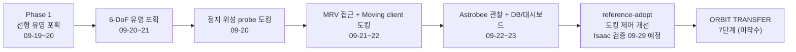

# 01. 비즈니스 요구사항

Automated Satellite Mission Extension System — Isaac Sim 기반 궤도상 위성 수명연장 임무 시뮬레이션

| 항목 | 내용 |
|---|---|
| 문서 범위 | 사업·임무 관점의 요구사항(BR-01~BR-08), 수용 기준, 성공 지표(KPI), 제약, 로드맵 |
| 기준 코드 | `feature/clean-files` (`e1fbab8`, 2026-09-23). 도킹 제어 개선은 `feature/reference-adopt` (`10a45ae`) |
| 관련 문서 | [02_system_requirements.md](02_system_requirements.md) · [03_interface_requirements.md](03_interface_requirements.md) · [04_scenario.md](04_scenario.md) · [05_branch_history.md](05_branch_history.md) · [06_references_and_improvements.md](06_references_and_improvements.md) |

### 수치 표기 규칙

| 표기 | 의미 |
|---|---|
| **설계값** | `project/config/vision_capture.yaml` 등 설정·코드에 정한 값. 실행으로 확인한 값이 아님 |
| **실측** | 당시 실행 결과 JSON·CSV·콘솔에서 기록한 값. 원본은 문서 재정비 이전 Git history의 실행 기록이며, `project/logs/**`는 git 추적 대상이 아니라 현재 작업 트리에 없음 |
| **미검증** | 요구하거나 설정했지만 실행으로 확인하지 않은 값 |

`yaml:N`은 `project/config/vision_capture.yaml`의 N번째 줄이다. `작업정리:N`과 `work-log:N`은 문서 재정비 전 Git history에 보존된 실행 기록의 줄 번호다. 오차는 모두 시뮬레이션 Ground Truth(GT) 기준이다.

---

## 0. 핵심 수치 요약

| 구분 | 지표 | 값 | 구분 | 출처 |
|---|---|---|---|---|
| 대상 | MEP 질량 | 3,000 kg | 설계값 | `yaml:11` |
| 대상 | MEP 유영 선속도 / 각속도 | 0.01 m/s / \|ω\| 0.0087 rad/s (0.50 °/s) | 설계값 | `yaml:18,23,26` |
| 대상 | Client 위성 표류 속도 | 0.02 m/s (+X), 회전 0 | 설계값 | `yaml:460,462` |
| 임무 | 7단계 중 구현 단계 | 6 / 7 (7단계 ORBIT TRANSFER 미구현) | 코드 | `README.md:111-123` |
| 임무 | 전체 파이프라인 성공 실행 | `full_6dof` #2: SUCCESS, checks 42/43, sim 203 s / 벽시계 1,958 s | 실측 | `작업정리:425` |
| 포획 | 포획 성공률 (판정 런) | 7/10 = 70 %, `six_dof` 이후 코드 4/4 = 100 % | 실측 | `작업정리:357,359` |
| 포획 | 포획 시각 | 24.95~32.22 s (한계 60 s) | 실측 | `작업정리:361`, `yaml:188` |
| 포획 | 포획 시 EE–마커 거리 / 법선각 / 횡오차 | 90.8~96.9 mm / 0.030~0.127° / 0.67~5.67 mm | 실측 | `작업정리:360` |
| 도킹 | 도킹 성공률 (판정 런) | 6/8 = 75 % (정지 client 3/3, 이동 client 3/5) | 실측 | `작업정리:379` |
| 도킹 | 결합 공차 (축/반경/축각/roll) | 40 mm / 40 mm / 2.0° / 4.0° | 설계값 | `yaml:381-384` |
| 도킹 | 이동 client 도킹 오차 | 축 0.92~3.41 mm, 반경 39.97~39.98 mm, 축각 0.153~0.171° | 실측 | `작업정리:374-375` |
| 비전 | 자세 추정 위치 / 각도 오차 평균 | 0.27 mm (n = 1,323) / 0.034° | 실측 | `작업정리:401-402` |
| 비전 | 판정 구간 4/4 태그 동시 검출 | 1,047 / 1,050 = 99.7 % | 실측 | `작업정리:400` |
| 운영 | Firestore 무료 읽기 한도 | 50,000 건/일 | 외부 제약 | `README.md:208` |
| 운영 | 실행 1건 조회 읽기 (캐시 전 → 후) | 846~2,077 건 → 재조회 0 건 | 실측 | `work-log:83,14` |
| 운영 | Firestore 기록 세션 / 임무 성공 | 38 세션 중 11 = 28.9 % (개발·중단 런 포함) | 실측 | `work-log:218,234` |
| 검증 | 현재 오프라인 테스트 함수 | 98개 (`project/tests`의 `def test_`, 2026-09-24 집계) | 코드 | `project/tests/` |
| 개발 | 커밋 / 기간 | 112 커밋, 2026-09-14 ~ 2026-09-23 (10일) | git | `git rev-list --all --count` |

---

## 1. 배경과 문제 정의

### 1.1 궤도상 서비싱과 수명연장

정지궤도 위성은 추진제가 떨어지면 탑재체가 정상이어도 임무를 끝냅니다. 수명연장 임무는 서비싱 위성(MRV, Mission Robotic Vehicle)이 로봇팔로 추진 모듈(MEP, Mission Extension Pod)을 붙잡아 고객 위성(Client Satellite)에 결합하고, 이후 MEP가 고객 위성의 궤도·자세를 유지하는 방식입니다. 이 프로젝트는 그 과정 중 **MEP 포획 → 운반 → 고객 위성 추력기 도킹 → MRV 분리** 를 물리 시뮬레이션으로 재현하고, 운영·검증 도구까지 한 체계로 묶습니다.

| 요소 | 이 프로젝트에서의 모델 | 근거 |
|---|---|---|
| MRV | Canadarm3 7-DoF 로봇팔 + 선체. 선체는 운동학적으로 평행이동 | `yaml:232-246`, `moving_dock.py:12-13` |
| MEP | 3,000 kg 강체, 무중력 자유유영, 부착면에 AprilTag 4개 | `yaml:11,66-81` |
| Client 위성 | GOES-R 모델(2.4배 축척), 무중력 동적 강체, 추력기 노즐이 도킹 포트 | `task.py:72`, `moving_dock.py:10` |
| 도킹 인터페이스 | MEP의 Ares1 probe 팁 → 위성 추력기 노즐 내부 도킹점, `FixedJoint` 결합 | `yaml:307-316` |
| 관찰기 | NASA Astrobee 자유비행 카메라 (충돌체 없는 시각 모델) | `yaml:562-572` |

### 1.2 기존 방식의 한계

2026-09-18~19 아이디어 회의에서 정리한 출발점의 한계는 다음과 같습니다.

| 한계 | 내용 | 이 프로젝트의 대응 |
|---|---|---|
| 정지 환경 | 기존 구현은 MEP·위성이 고정된 상태에서만 동작. 실제 궤도에서는 표류·회전함 | MEP 6-DoF 유영(`motion_mode: six_dof`, `yaml:15`), Client 위성 0.02 m/s 표류(`yaml:460`) |
| 하드코딩 IK | 사전에 넣은 절대 좌표로 IK 경로를 추종. 대상이 움직이면 실패 | 손목 카메라 AprilTag PnP로 목표를 매 프레임 추정(10 Hz, `yaml:90`), 0.3 s 선행 예측(`yaml:96`) |
| 기하 하드코딩 | 결합점·도킹점 좌표를 상수로 둠 | 시작 시 USD 메시에서 결합점·도킹 프레임을 측정(`yaml:7-8`, `yaml:418-424`) |
| 검증 근거 부족 | 성공 여부가 화면 확인에 의존 | 결과 JSON checks, Firestore 기록, 대시보드 KPI |

회의에서 딥러닝 기반 인식은 개발 기간·지연 문제로 배제하고, 단안 카메라 1대로 6-DoF 역산이 가능한 AprilTag 방식을 채택했습니다.

---

## 2. 목표와 범위

### 2.1 목표

1. 무중력에서 움직이는 3 t MEP를 비전만으로 포획하고(GT는 제어에 쓰지 않음), 표류하는 고객 위성에 도킹하는 전 과정을 한 번의 실행으로 끝까지 수행합니다.
2. 실행마다 수치(오차·속도·시간·성공 여부)를 남기고, 대시보드에서 실시간 상황과 누적 성과를 확인할 수 있게 합니다.

### 2.2 범위

| 구분 | 항목 |
|---|---|
| **In-scope** | 임무 1~6단계 (MRV 이동, Astrobee 배치, MEP 탐색·포획, 도킹 준비, 도킹, 분리) |
| | 3,000 kg MEP 6-DoF 유영, Client 위성 병진 표류 |
| | AprilTag 4개 PnP 자세 추정, 등속 twist 예측, DLS IK 추종 |
| | probe RGB-D 카메라 기반 도킹축 거리 측정 |
| | ROS 2 토픽 출력·명령 수신, Firestore 기록, FastAPI 대시보드(LIVE / VALIDATION) |
| | 설정 파일 기반 시나리오 변경, 시뮬레이터 없이 도는 오프라인 테스트 |
| **Out-of-scope** | **7단계 ORBIT TRANSFER** (도킹 스택의 궤도 이송). 대시보드에 단계 칸만 있고 텔레메트리 없음 (`validation.js:99-103,497`) |
| | 실제 하드웨어·비행 소프트웨어. 모든 결과는 PhysX 강체 시뮬레이션 |
| | 궤도 역학(Clohessy-Wiltshire 등), 추진제 소모, 열·통신 지연 모델 |
| | 회전하는 Client 위성 도킹 (`yaml:461-462`: "a rotating client is not a verified configuration") |
| | MEP 부착면이 반대로 향하는 사각지대 탐색 (회의록 Phase 2 과제, 미착수) |
| | headless 실행의 임무 영상 (뷰포트 캡처가 GUI 전용, `README.md:103,207`) |
| | 딥러닝 기반 인식 |

---

## 3. 이해관계자와 사용자

| 이해관계자 | 역할 | 주 관심사 | 주로 쓰는 기능 |
|---|---|---|---|
| 운영자 (Operator) | 시뮬레이션을 시작·정지하고 진행을 감시 | 현재 단계, 잔여 거리, 위치 오차, 카메라 영상 | LIVE MISSION 탭, PLAY / PAUSE / STOP (`/mrv/cmd/{start,pause,resume,abort}`, `app.py:1040`) |
| 평가자 / 심사자 | 기술 성숙도와 결과를 판단 | 성공률, 포획·도킹 정밀도, 임무 시간, 재현성, 근거 영상 | TECHNOLOGY VALIDATION 탭, 결과 JSON checks |
| 개발팀 | 알고리즘·제어·UI 개발 | 파라미터 조정, 회귀 방지, 실패 원인 추적 | `vision_capture.yaml`, `--set` 덮어쓰기, `project/tests/`, CSV 로그 |

---

## 4. 비즈니스 요구사항

달성 현황 기준: **달성** = 수용 기준을 실측으로 모두 확인 / **부분** = 일부만 실측 확인 또는 기준 일부 미충족 / **미구현** = 기능 없음.

| ID | 요구사항 | 근거 / 동기 | 수용 기준 | 달성 현황 |
|---|---|---|---|---|
| BR-01 | 궤도상 위성 수명연장 임무(MEP 포획 → Client 위성 도킹)의 end-to-end 자동 수행 시연 | 개별 기능이 아니라 임무 단위의 성공을 보여야 사업 가치가 설명됨 | (a) 1회 실행으로 1~6단계를 사람 개입 없이 통과해 `SUCCESS` 도달 (b) 결과 checks 실패는 임무 판정과 무관한 항목에 한정 (c) 7단계는 범위 밖으로 명시 | **부분.** (a) `full_6dof` #2 SUCCESS, checks 42/43, sim 203 s (`작업정리:425`). 실패 1건은 `[DOCK3]` 깊이 일치 (`작업정리:428`) (b) 충족 (c) 7단계 **미구현** (`README.md:123,206`) |
| BR-02 | 실제 궤도 환경 반영: 무중력, 병진·회전 유영하는 3 t MEP, 표류하는 Client 위성 (하드코딩 좌표 배제) | 정지 환경·고정 좌표 IK로는 실제 우주 환경을 설명할 수 없음 (회의록 1장) | (a) 중력 0, MEP 3,000 kg을 시작 시 check로 확인 (b) MEP 병진 + 3축 복합 회전, 감쇠 0 (c) Client 위성이 자유 동적 강체로 표류 (d) 결합점·도킹점은 USD에서 측정 | **부분.** (a) `Zero gravity`, `MEP mass is 3000 kg` check (`vision_capture_demo.py:967-968`) (b) 설계 \|ω\| 0.50 °/s. 감쇠 버그(25 s 동안 0.0084 → 0.0025 rad/s) 수정 후 0.00502 vs 지령 0.005 rad/s 유지 (`작업정리:158-159`). 회의록 목표 1~3 °/s 는 **미검증** (c) Client 0.02 m/s 병진만, 회전 client 는 범위 밖 (`yaml:460-462`) (d) 충족 (`yaml:7-8`, `docking.py:383-387`) |
| BR-03 | 비전 기반 목표 인식·추종 (AprilTag, 손목 카메라 PBVS, 표류 예측 요격) | GT 없이 센서만으로 움직이는 대상을 잡아야 실제 임무로 확장 가능 | (a) 제어 입력에 GT 미사용 (b) 정지 추정 오차 < 5 mm, < 0.5° (c) 60 s 이내 포획, 접촉 상대속도 < 0.05 m/s (d) 포획 조건: 거리 ≤ 150 mm, 각도 ≤ 5°, 횡 ≤ 20 mm | **달성.** (b) 프레임별 추정 오차 평균 0.27 mm / 0.034°, 동적 런 최대 6.94 mm (`작업정리:401-402`) (c) 포획 24.95~32.22 s, 상대속도 6.3~8.7 mm/s (`작업정리:343-352,361`) (d) 거리 90.8~96.9 mm, 법선각 ≤ 0.127°, 횡 ≤ 5.67 mm (`작업정리:360`). 전체 성공률 70 %, 현 코드 계열 4/4 |
| BR-04 | 임무 관찰: Astrobee 자유비행 카메라로 위성·임무 상황 가시화 | 로봇팔 손목·probe 카메라만으로는 전체 상황(상대 배치, 분리)을 보여줄 수 없음 | (a) 위성 주위 관측점 순회 (b) 영상 ROS 2 발행 (c) 도킹 후 분리하는 MRV를 추적·근접 (d) 임무 파이프라인에 물리적 간섭 0 | **달성(일부 미검증).** (a) 관측점 4개(방위 45/135/225/315°), 체류 5 s, 링 여유 25 m, 고도각 25° (`yaml:583-587`, 설계값) (b) 640×480, 5 Hz (`yaml:603-610`, 설계값) (c) 근접 3 m/s, 정지 거리 10 m (`yaml:595-597`). 3 m/s 는 결과 JSON에 기록되지 않아 **미검증** (`작업정리:430`) (d) 충돌체 없는 시각 모델 (`astrobee.py:19-20`) |
| BR-05 | 운영 모니터링·원격 제어: 웹 대시보드 실시간 표시, PLAY/PAUSE/STOP | 운영자가 시뮬레이터 PC 없이 원격에서 임무를 제어·감시해야 함 | (a) LIVE 탭에 단계 진행률(n/7), 속도·거리·위치 오차, 카메라 3면 + 뷰포트 표시 (b) PLAY/PAUSE/STOP 이 ROS 2 명령으로 전달 (c) 명령 실패 시 원인 표시 | **달성.** (a) `index.html:23-26` (진행률 `/7`) (b) `start/pause/resume/abort` 4종 (`app.py:1040`, `ros_interface.py:126-129`) (c) ROS 미연결 시 503 + 원인 (`app.py:1046-1050`). 명령→반영 지연은 **미측정** |
| BR-06 | 기술 검증 근거 축적: 실행 이력 DB 저장, KPI(성공률·정밀도·임무 시간), 구간 영상 재생 | 심사·평가에 반복 실행의 통계가 필요 | (a) 실행마다 세션 요약 + 5 Hz 텔레메트리 저장 (b) 성공률은 `mission_success` 기준 (c) 포획·도킹 정밀도는 성공 런 오차의 표준편차 (d) 그래프 구간 → 영상 구간 재생 (e) 무료 한도(50,000 읽기/일) 안에서 운영 | **부분.** (a) 38 세션 기록 (`work-log:218`), 기본 5 Hz (`firebase_bridge.py:684`) (b)(c) `validation.js:153-170,687-699` (d) 동작 확인, 그러나 당시 35 런 중 재생 가능 영상 1건 (`work-log:54-61`), headless 영상 없음 (e) 재조회 읽기 0, 응답 0.349 → 0.056 s (`work-log:14-17`). 네트워크 단절 시 배치 손실(`dropped 140 writes`, `work-log:263`) |
| BR-07 | 재현성·확장성: 설정 파일 기반 시나리오 변경, 오프라인 자동 테스트 | 파라미터 변경마다 코드 수정 없이 재실행·비교해야 함 | (a) 시나리오 파라미터를 단일 YAML로 관리, CLI `--set` 로 덮어쓰기 (b) 시뮬레이터 없이 도는 단위 테스트 (c) 대시보드 캐시 동작 검증 스크립트 | **부분.** (a) `vision_capture.yaml` 612줄, `--set SECTION.KEY=VALUE` (`README.md:109`) (b) 현재 `def test_` 98개. reference-adopt historical 실행에서는 `test_vision_math.py` 4건이 오래된 기대값·cv2 버전으로 실패 (해당 branch의 설계 기록) (c) `cache_check.py` 9/9 PASS (`work-log:179`) |
| BR-08 | 제어 성능 고도화: 선행 연구 기반 도킹 제어 개선 | 이동 client 도킹 횡오차가 결합 한계 40 mm에 붙어 있고(39.97~39.98 mm), 삽입 중 최대 187 mm 흔들림 | (a) 선행 연구 기반 제어기(예측 목표 + 위치·자세 동시 정렬)를 설정 플래그로 제공, 기본값은 검증된 legacy 유지 (b) 오프라인 테스트 통과 (c) Isaac Sim에서 legacy 대비 도킹 성공·횡오차 개선 확인 | **부분.** (a) `feature/reference-adopt`: `coupled_dock.py` 556줄, `docking_control.mode` (b) 문서 기준 25/25 통과 (`def test_` 21개 + parametrize) (c) **미검증.** 스모크 2회는 도킹 전 중단, Isaac Sim 시험은 2026-09-29 예정 (커밋 `10a45ae`) |

---

## 5. 성공 지표 (KPI)

### 5.1 임무·포획

| KPI | 목표 / 한계 | 구분 | 실측 | 판정 | 출처 |
|---|---|---|---|---|---|
| 임무 완주 (1~6단계 SUCCESS) | 1회 이상 | 설계 목표 | `full_6dof` #2 SUCCESS (42/43) | 충족 | `작업정리:425` |
| 임무 시간 (sim) | 명시 목표 없음. 도킹 단계 상한 600 s | 설계값 | 199 s (#1), 203 s (#2) | — | `작업정리:424-425`, `yaml:415` |
| 임무 시간 (벽시계, GUI) | — | — | 1,931 s (#1), 1,958 s (#2) | — | `작업정리:424-425` |
| MRV 이동 후 위치 오차 | ≤ 20 mm | 설계값 | 0.00 mm | 충족 | `yaml:256`, `작업정리:150` |
| 포획 성공률 | — | — | 70 % (7/10), 현 코드 계열 100 % (4/4) | — | `작업정리:357-359` |
| 포획 소요 시간 | < 60 s | 설계값 | 24.95~32.22 s | 충족 | `yaml:188`, `작업정리:361` |
| 포획 시 EE–결합점 거리 | ≤ 150 mm | 설계값 | 90.8~96.9 mm | 충족 | `yaml:165`, `작업정리:360` |
| 포획 시 각도 오차 | ≤ 5° | 설계값 | 0.030~0.127° | 충족 | `yaml:166`, `작업정리:360` |
| 포획 시 횡오차 | ≤ 20 mm | 설계값 | 0.67~5.67 mm | 충족 | `yaml:173`, `작업정리:360` |
| 포획 시 상대속도 | ≤ 50 mm/s | 설계값 | 6.3~8.7 mm/s | 충족 | `yaml:167`, `작업정리:343-352` |
| 포획 시 상대 각속도 (six_dof) | ≤ 0.01 rad/s | 설계값 (제안값) | 0.0007~0.0009 rad/s | 충족 | `yaml:170`, 문서 재정비 전 six_dof 실행 기록 |
| 포획 유지 중 MEP–EE 드리프트 | ≤ 5 mm, ≤ 0.5° | 설계값 | 최대 0.616 mm / 0.022° | 충족 | `yaml:190-191`, `작업정리:362` |

### 5.2 도킹

| KPI | 목표 / 한계 | 구분 | 실측 (정지 client) | 실측 (이동 client, 위성 2.4배) | 출처 |
|---|---|---|---|---|---|
| 도킹 성공률 | — | — | 3/3 | 3/5 | `작업정리:379` |
| 축방향 오차 | ≤ 40 mm | 설계값 | 0.08~9.98 mm | 0.92~3.41 mm | `yaml:381`, `작업정리:380` |
| 반경방향 오차 | ≤ 40 mm | 설계값 | 1.92~6.53 mm | 39.97~39.98 mm (**한계 근접**) | `yaml:382`, `작업정리:380,387` |
| 축 기울기 | ≤ 2.0° | 설계값 | 0.007~0.025° | 0.153~0.171° | `yaml:383`, `작업정리:381` |
| 축 둘레 roll | ≤ 4.0° | 설계값 | 0.004~0.013° | 0.066~0.203° | `yaml:384`, `작업정리:381` |
| 도킹 시 상대속도 | ≤ 50 mm/s | 설계값 | 4.6 mm/s | 11.6~27.4 mm/s | `yaml:385`, `작업정리:370,374-375` |
| 노즐 벽 최소 여유 | ≥ 20 mm | 설계값 | 381 mm | — (2.4배 축척 후 노즐 내경 0.466 → 0.319 m) | `yaml:386`, `작업정리:126,454` |
| 도킹 후 MEP–client 드리프트 | 유지 | — | 10 s 동안 0.000 mm / 0.0000° | 0.00 mm | `작업정리:382` |
| probe 깊이 vs 기하 거리 평균 차 | 밴드 150 mm | 설계값 | 4 mm, 이탈 1.2 % | 380~395 mm, 이탈 93~94 % (`[DOCK3]` FAIL) | `yaml:395`, `작업정리:414-416` |
| MRV 분리 거리 | ≥ 0.1 m 증가 | 설계값 | — | +7.62 m, 팔 접촉력 0.0 N (한계 50 N) | `yaml:553-554`, `작업정리:428` |

정지 client 수치는 결합 공차가 10 mm / 0.5°였던 2026-09-20 실행의 historical 값이다. 현재 공차는 40 mm / 2.0°다.

### 5.3 인지 (비전)

| KPI | 목표 / 한계 | 구분 | 실측 | 출처 |
|---|---|---|---|---|
| 정지 추정 위치 오차 | < 5 mm | 설계값 | 프레임 평균 0.27 mm (n = 1,323), 동적 런 p95 0.94 mm, 최대 6.94 mm | `yaml:183`, `작업정리:401` |
| 정지 추정 각도 오차 | < 0.5° | 설계값 | 평균 0.034°, 동적 런 p95 0.083°, 최대 0.346° | `yaml:184`, `작업정리:402` |
| 재투영 RMS | ≤ 1.5 px | 설계값 | 평균 0.36 px, 최대 1.66 px | `yaml:84`, `작업정리:403` |
| 판정 구간 4/4 태그 동시 검출 | 4/4 필수 | 설계값 | 99.7 % (1,047/1,050) | `yaml:81`, `작업정리:400` |
| SEARCH 이후 검출률 | — | — | 100 % | `작업정리:398` |
| 인지 실패로 끝난 런 | 0 | — | 2 (`fix1`, `mrv_smoke`, 이후 수정) | `작업정리:405` |

### 5.4 운영·대시보드·검증 체계

| KPI | 목표 / 한계 | 구분 | 실측 | 출처 |
|---|---|---|---|---|
| Firestore 일일 읽기 | ≤ 50,000 건 | 외부 제약 | 캐시 전: 실행 1건 846~2,077 건 (약 48회 클릭에 소진) | `README.md:208`, `work-log:18,83` |
| 끝난 실행 재조회 읽기 | 0 | 설계 목표 | 1,036 → 0 건 | `work-log:14` |
| 실행 1건 응답 시간 | — | — | 0.349 → 0.056 s (6.2배) | `work-log:16` |
| 실행 목록 응답 시간 | 목록 캐시 TTL 60 s | 설계값 | 0.624 → 0.002 s (312배) | `app.py:46`, `work-log:17` |
| 텔레메트리 기록 주기 | 5 Hz (sim 시간 기준) | 설계값 | 1,036행 / 실행 1건 (예시) | `firebase_bridge.py:684`, `work-log:189` |
| 쓰기 배치 / 재시도 | 400건 / 5회 | 설계값 | 1건 네트워크 단절로 140 writes 유실 | `firebase_bridge.py:111,175`, `work-log:263` |
| 전체 임무 성공률 (DB) | — | — | 11/38 = 28.9 % (개발 중 중단 런 포함, 백필 후) | `work-log:234` |
| 구간 영상 재생 가능 실행 | GUI 실행 100 % | 설계 목표 | 1/35 (기능 도입 전 27, `.mp4.part` 2, 프레임 없음 5) | `work-log:54-61` |
| 오프라인 테스트 | 시뮬레이터 불필요 | — | 현재 `def test_` 98개; historical 집계는 94개 | `project/tests/test_*.py` |
| 대시보드 캐시 검증 | 전부 PASS | — | 9/9 PASS | `work-log:179` |
| 렌더링 시간 (10 s 구간) | — | — | 116 s → 39 s (`supersample` 2 → 1) | `yaml:59-62`, `작업정리:134` |

---

## 6. 제약과 가정

### 6.1 기술 제약

| 항목 | 값 | 영향 | 출처 |
|---|---|---|---|
| 시뮬레이터 | Isaac Sim 5.x (`~/isaac-sim/python.sh`), Isaac Lab, Space Robotics Bench 포크 | 시뮬레이션 코드는 Isaac Sim 번들 Python에서만 실행 | `README.md:30,184` |
| 미들웨어 | ROS 2 Jazzy, 두 PC의 `ROS_DOMAIN_ID` 일치 | 대시보드·브리지는 `--system-site-packages` venv 필요 | `README.md:31,36,45` |
| OS | Ubuntu 24.04 (검증 환경) | 다른 OS는 미검증 | `README.md:34` |
| 영상 인코딩 | ffmpeg 6.x, H.264 | GUI 실행에서만 임무 영상 생성 | `README.md:32,144` |
| DB | Firebase Firestore 무료(Spark) 한도: 읽기 50,000 건/일, 미국 태평양시 자정 리셋 | 끝난 실행 캐시 필수, 소진 시 캐시본 표시 | `README.md:149,208-209` |
| 실행 1건 읽기 비용 | 800~2,000 건 (README), 실측 846~2,077 건 | 캐시 없이 약 25~60회 조회로 한도 소진 | `README.md:149`, `work-log:83` |
| 비밀 정보 | `serviceAccount.json` 은 커밋 금지 (`.gitignore`) | 신규 환경은 키를 별도 전달 | `README.md:60-62` |
| 연산 비용 | GUI 실행 시 sim 1 s 당 벽시계 약 8~10 s (`full_6dof` 203 s → 1,958 s) | 전체 임무 1회 약 33분 | `작업정리:425` |
| GPU 메모리 | 테스트 도중 중단 시 잔여 Isaac Sim 프로세스 8개가 약 15 GB 점유 | 전체 pytest 중단 시 자식 프로세스 확인 필요 | `작업정리:232-234` |

### 6.2 가정

| 가정 | 내용 | 근거 / 한계 |
|---|---|---|
| 협조 타깃 | MEP 부착면에 AprilTag 4개(tag36h11, 60 mm, ID 0~3)가 있고 접근 중 카메라 시야 안에 있음 | `yaml:66-81`. 사각지대 탐색은 범위 밖 |
| MRV 운동 | MRV 선체는 추력 모델 없이 운동학적으로 이동(속도 0.4 m/s, 가속 0.15 m/s²) | `yaml:253-254`, `moving_dock.py:12-13` |
| 강체 | 팔·MEP·위성은 강체, 유연체·연료 슬로싱 없음 | 현재 task·asset 구현에 deformable/FEM 모델 없음 |
| 궤도 역학 | 상대 운동은 등속 직선 + 등각속도로 근사 (궤도 역학 항 없음) | `yaml:110-117` |
| 평가 기준 | 오차·성공 판정은 시뮬레이션 GT 기준. GT는 판정·로그에만 쓰고 제어에는 쓰지 않음 | `yaml:218`, 결과 JSON checks |
| 실측 통계 표본 | 성공률·오차 범위는 2026-09-20~22 판정 런 10건(포획), 8건(도킹) 기준. 통계적 신뢰구간을 낼 표본 수는 아님 | `작업정리:340-383` |

---

## 7. 로드맵

| 단계 | 기간 | 내용 | 결과 (수치) | 상태 |
|---|---|---|---|---|
| Phase 1 — 선형 유영 포획 | 2026-09-19~20 (`feature/apriltag`) | 3 t MEP 선형 유영(0.01~0.02 m/s), AprilTag 4개 PnP, 0.3 s 예측, DLS IK, FixedJoint 포획 | `offsettest` 20/20, 포획 26.24 s, 횡 0.70 mm (`작업정리:343`) | 완료 |
| 6-DoF 유영 포획 | 2026-09-20~21 (`feature/rotation`) | XYZ 병진 + 3축 복합 회전, ConstantTwist 예측 | `six_dof` 26/26, 포획 26.77 s (`작업정리:349`). 각속도 보고값과 자세 변화율 8 % 불일치는 원인 미확인 | 완료 (0.5 °/s 에서만 검증) |
| 정지 위성 probe 도킹 | 2026-09-20 (`feature/docking*`) | Ares1 probe → 추력기 노즐, RGB-D 깊이 게이트 | 20/20 PASS, 축 −9.98 mm, 반경 6.53 mm (`작업정리:117-130`) | 완료 |
| MRV 접근 + Moving client 도킹 | 2026-09-21~22 (`feature/integration`) | MRV 2구간 이동, Client 0.02 m/s 표류, 속도 정합, 강제 삽입, 분리 | 도킹 시작 대기 32 s → 0 s, 이동 도킹 3/5 (`작업정리:143,379`) | 완료. 횡오차 한계 근접이 남은 리스크 |
| Astrobee 관찰 + DB/대시보드 | 2026-09-22~23 (`feature/web-integration-v2`, `feature/clean-files`) | Astrobee 순회·추적, Firestore 기록, LIVE/VALIDATION 탭, 읽기 캐시 | `full_6dof` #2 SUCCESS 42/43, 재조회 읽기 0 | 완료 |
| 도킹 제어 개선 (reference-adopt) | 2026-09-23~ (`feature/reference-adopt`) | 예측 목표 + 위치·자세 동시 정렬, soft gate. +1,794 / −14 줄, 11 파일 | 오프라인 25/25. Isaac Sim 스모크 2회 모두 도킹 전 중단 | 진행 중. Isaac Sim 시험 2026-09-29 예정 (`10a45ae`) |
| 7단계 ORBIT TRANSFER | 미정 | 도킹 스택의 궤도 이송 | — | **미착수** |

### 7.1 로드맵상 남은 과제

| 과제 | 관련 BR | 현재 값 | 목표 |
|---|---|---|---|
| 이동 client 도킹 반경 오차 여유 확보 | BR-08 | 39.97~39.98 mm (한계 40 mm) | 한계 대비 여유 확보 (목표치 **미정**) |
| 위성 2.4배 축척 후 깊이 보정 | BR-01, BR-03 | 평균 차 380~395 mm, `[DOCK3]` FAIL | 밴드 150 mm 이내 (정지 client 수준 4 mm) |
| `--dock_only` 정체 (횡오차 ≈ 235~242 mm) | BR-07 | 미해결 (`작업정리:434-478`) | 전용 경로 수정 후 회귀 |
| MEP 회전율 상향 | BR-02 | 0.50 °/s 에서만 검증 | 회의록 목표 1~3 °/s |
| headless 임무 영상 | BR-06 | 미지원 | 미정 |
| 7단계 궤도 이송 | BR-01 | 미구현 | 미정 |

상세한 기능·비기능 요구는 [02_system_requirements.md](02_system_requirements.md), 토픽·API·DB 규격은 [03_interface_requirements.md](03_interface_requirements.md), 단계별 동작은 [04_scenario.md](04_scenario.md), 브랜치별 경과는 [05_branch_history.md](05_branch_history.md), 도킹 제어 개선 근거는 [06_references_and_improvements.md](06_references_and_improvements.md) 에 있습니다.
