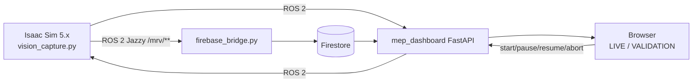

# 02. 시스템 요구사항

기준: `feature/clean-files` (`e1fbab8`)와 기본 설정 `project/config/vision_capture.yaml`. 제어 개선안은 아직 미병합 `feature/reference-adopt`이며 [06_references_and_improvements.md](06_references_and_improvements.md)에 분리한다. 비즈니스 요구사항은 [01_business_requirements.md](01_business_requirements.md)를 따른다.

## 1. 구성과 실행 환경

| 항목 | 요구값 | 근거 |
|---|---:|---|
| 시뮬레이터 | Isaac Sim 5.x | `README.md:30` |
| 미들웨어 | ROS 2 Jazzy, 두 호스트의 동일 `ROS_DOMAIN_ID` | `README.md:31,36` |
| 검증 OS | Ubuntu 24.04 | `README.md:34` |
| 영상 | ffmpeg 6.x, H.264; GUI에서만 캡처 | `README.md:32,140-144` |
| DB | Firebase Firestore | `README.md:33` |
| MEP 질량 | 3,000 kg (설계값) | `vision_capture.yaml:10-11` |
| 텔레메트리/ROS 주기 | 10 Hz / Firestore 기본 5 Hz | `vision_capture.yaml:196-200,213-224`, `README.md:131-134` |

## 2. 기능 요구사항

| ID | BR | 요구사항 | 정량 수용 기준 | 구현 위치 / 검증 |
|---|---|---|---|---|
| SR-F-01 | BR-02 | 무중력 6-DoF MEP를 생성한다. | 3,000 kg, 선속도 0.01 m/s, \|ω\| 0.0087 rad/s=0.50°/s (설계값) | `vision_capture.yaml:10-37`, `vision_capture_demo.py` |
| SR-F-02 | BR-03 | 손목 카메라와 AprilTag로 MEP 부착점을 추정·예측한다. | tag36h11 4개(ID 0–3), 60 mm; 1280×720, 90°, 10 Hz; 예측 horizon 0.3 s | `vision_capture.yaml:39-117`, `vision.py` |
| SR-F-03 | BR-03 | 예측 pose를 DLS IK로 추종하고 물리 결합한다. | 캡처: 거리 ≤150 mm, 각도 ≤5°, 상대속도 ≤0.05 m/s, 횡오차 ≤20 mm | `vision_capture.yaml:119-180`, `capture.py` |
| SR-F-04 | BR-01 | MRV가 2구간으로 접근하고 팔을 전개한다. | 시작 오프셋 [-5,0,-3] m, 0.4 m/s, 0.15 m/s², 위치 공차 20 mm, 전개 10 s | `vision_capture.yaml:232-289`, `mrv_approach.py` |
| SR-F-05 | BR-01/08 | Ares1 probe를 Client 노즐에 정렬·삽입하고 `FixedJoint`를 만든다. | 축/반경 ≤40 mm, 축각 ≤2°, roll ≤4°, 상대속도 ≤0.05 m/s, hold 3 s | `vision_capture.yaml:307-416`, `probe_dock.py`, `docking.py` |
| SR-F-06 | BR-02 | 이동 Client 도킹을 지원한다. | Client 기본값은 정지; 동적 시나리오는 병진 표류만 검증 범위 | `moving_dock.py`, `vision_capture.py:61-66` |
| SR-F-07 | BR-04 | Astrobee를 관찰 전용 객체로 운용한다. | 640×480, 5 Hz; 4 관측 방위(45/135/225/315°), 각 5 s; collider 없음 | `vision_capture.yaml:562-612`, `astrobee.py` |
| SR-F-08 | BR-05 | 웹이 실시간 상태·카메라를 표시하고 임무 명령을 전달한다. | `start/pause/resume/abort` 4종; 7단계 진행률 | `mep_dashboard/backend/app.py:1038-1050`, `README.md:111-125` |
| SR-F-09 | BR-06 | 실행 요약과 시계열을 저장·재생한다. | `simulation_sessions/{id}` + telemetry; GUI 영상 `.mp4`와 `t0_sim_s` sidecar | `firebase_bridge.py`, `README.md:129-152` |
| SR-F-10 | BR-07 | YAML/CLI로 시나리오를 재현한다. | `--set SECTION.KEY=VALUE`, `--headless`, `--dock_only`, `--no_dock` 등 | `vision_capture.py:47-81` |

## 3. 비기능 요구사항

| ID | BR | 요구사항 | 기준 / 상태 |
|---|---|---|---|
| SR-N-01 | BR-03 | 비전 품질을 시험 가능하게 한다. | 정지 시험 임계값 위치 <5 mm·각도 <0.5°; 3 standoff×30 표본 (설계값): `vision_capture.yaml:182-191` |
| SR-N-02 | BR-01 | 도킹 상태의 무한 반복을 제한한다. | 상태 timeout 240 s, phase timeout 600 s: `vision_capture.yaml:410-416` |
| SR-N-03 | BR-05 | 제어 명령 실패를 명시한다. | ROS 연결 없음은 HTTP 503; 실패는 실패 단계 번호 유지: `app.py:1038-1050`, `README.md:125` |
| SR-N-04 | BR-06 | Firestore 읽기 비용을 제한한다. | 종료 실행 telemetry 캐시, 캐시 파일 `mep_dashboard/.cache/validation`; 무료 한도 50,000 reads/day: `README.md:146-152,208-209` |
| SR-N-05 | BR-06 | 네트워크 실패를 제한적으로 재시도한다. | 브리지는 최대 5회 후 배치 유실을 로그로 알림: `README.md:212-213` |
| SR-N-06 | BR-06 | 서비스 계정 비밀을 저장소에 넣지 않는다. | `serviceAccount.json`은 `.gitignore`; 환경별 별도 제공: `README.md:60-62` |
| SR-N-07 | BR-07 | 오프라인 회귀 기반을 유지한다. | 현재 `project/tests`의 `def test_` 98개(2026-09-24 코드 검색); Isaac Sim smoke는 별도: `README.md:187-202` |

## 4. 상태 요구사항

임무는 `MRV_APPROACH_* → SEARCH → APPROACH/CAPTURE/HOLDING → PRE_DOCK_APPROACH → ALIGNMENT_CHECK → Z_APPROACH → FINAL_INSERTION → DOCK_READY → STABILIZING/RELEASE/SEPARATION` 순으로 실행한다. 각 단계는 조건 실패·timeout·abort에서 `FAILED` 또는 `ABORTED`로 끝나며, UI에는 실패가 발생한 임무 단계(1–6)를 유지한다. 7단계 `ORBIT TRANSFER`는 표시 전용이며 미구현이다 (`README.md:111-125`).

## 5. 추적성

| BR | 연결 SR |
|---|---|
| BR-01 | SR-F-04, 05, SR-N-02, 03 |
| BR-02 | SR-F-01, 06 |
| BR-03 | SR-F-02, 03, SR-N-01 |
| BR-04 | SR-F-07 |
| BR-05 | SR-F-08, SR-N-03 |
| BR-06 | SR-F-09, SR-N-04~06 |
| BR-07 | SR-F-10, SR-N-07 |
| BR-08 | SR-F-05 |
