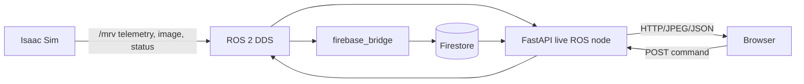

# 03. 인터페이스 요구사항

기준 구현은 `project/srb/tasks/manipulation/debris_capture/ros_interface.py`, `project/scripts/firebase_bridge.py`, `mep_dashboard/backend/app.py`다. 토픽은 world frame, SI 단위를 사용한다. 내부 quaternion `(w,x,y,z)`는 ROS에서 `(x,y,z,w)`로 변환한다 (`ros_interface.py:30-31`).

## 1. 통신 경로

## 2. ROS 2 인터페이스

| ID | BR | 방향 | 토픽 | 타입 | 내용 / 단위 | 주기 |
|---|---|---|---|---|---|---:|
| IR-01 | BR-03 | out | `/mrv/cam_wrist/image_raw` | `sensor_msgs/Image` | RGB8 비전 입력 | 설정상 10 Hz |
| IR-02 | BR-03 | out | `/mrv/cam_wrist/camera_info` | `sensor_msgs/CameraInfo` | intrinsic, 무왜곡 | 10 Hz |
| IR-03 | BR-05 | out | `/mrv/viewport/image_raw` | `sensor_msgs/Image` | GUI viewport RGB8; headless 불가 | GUI 전용 |
| IR-04 | BR-03 | out | `/mrv/estimate/cylinder_pose`, `/predicted/cylinder_pose`, `/ee/pose`, `/ee/target_pose` | `geometry_msgs/PoseStamped` | 추정/예측 MEP 결합점 및 EE pose; m, quaternion | 10 Hz |
| IR-05 | BR-01 | out | `/mrv/dock/probe_pose`, `/dock/target_pose` | `PoseStamped` | probe tip / SAT_DOCK_POINT | 도킹 중 |
| IR-06 | BR-03 | out | `/mrv/estimate/mep_twist` | `geometry_msgs/TwistStamped` | 선속도 m/s, 각속도 rad/s | 10 Hz |
| IR-07 | BR-06 | out | `/mrv/gt/cylinder_pose`, `/gt/mep_twist` | Pose/Twist | 평가용 GT; 제어 입력 금지 | 10 Hz |
| IR-08 | BR-05 | out | `/mrv/state`, `/mrv/captured`, `/mrv/status` | String/Bool/String JSON | 상태(latched), FixedJoint 여부, metrics/tags/standoff | 10 Hz |
| IR-09 | BR-03 | out | `/tf` | `tf2_msgs/TFMessage` | `world → cylinder_est/cylinder_pred/ee/cam_wrist/cylinder_gt` | 10 Hz |
| IR-10 | BR-04 | out | `/astrobee/camera/image_raw` | `sensor_msgs/Image` | 640×480 RGB8 관찰 영상 | 5 Hz |
| IR-11 | BR-05 | in | `/mrv/cmd/start`, `pause`, `resume`, `abort`, `reset` | `std_msgs/Empty` | 시작·일시정지·재개·안전 중단·초기화 | event |
| IR-12 | BR-03 | in | `/mrv/cmd/capture_enable` | `std_msgs/Bool` | false면 추적만 하고 결합 금지 | event |

근거: `ros_interface.py:3-31`, `vision_capture.yaml:213-230,598-610`. `start`는 `ros.require_start_cmd=true`일 때만 게이트 역할을 한다.

## 3. Firestore 인터페이스

| ID | BR | 경로 | 데이터 | 제약 |
|---|---|---|---|---|
| IR-13 | BR-06 | `simulation_sessions/{session_id}` | 성공 여부, 최종 KPI, 시작/종료 정보 | ID: `run_YYYYMMDD_HHMMSS` |
| IR-14 | BR-06 | `simulation_sessions/{session_id}/session_telemetry/{n}` | 시계열 상태·pose·오차·속도 | 기본 sim-time 5 Hz |
| IR-15 | BR-06 | bridge → Firestore | 배치 기록·재시도 | 400건 batch, 최대 5회; 실패 batch는 유실 가능 |

`session_id` 형식과 영상 동기화는 `README.md:129-144`, 재시도 한계는 `README.md:212-213`을 따른다. 완료 세션은 dashboard cache로 재조회하며, Firestore 접근 불가 시 UI는 `CACHED DATA`를 표시한다 (`README.md:146-152`).

## 4. HTTP 인터페이스

| ID | BR | Method / path | 응답 |
|---|---|---|---|
| IR-16 | BR-05 | `GET /health` | live ROS 연결 상태 |
| IR-17 | BR-06 | `GET /api/validation/runs` | 저장된 세션 목록; 종료 세션 캐시 사용 |
| IR-18 | BR-06 | `GET /api/validation/runs/{session_id}/telemetry` | 세션 telemetry JSON; ID 정규식 불일치 400 |
| IR-19 | BR-06 | `GET /api/validation/runs/{session_id}/video-metadata` | `<session>.video.json`, `t0_sim_s` |
| IR-20 | BR-06 | `GET /api/validation/runs/{session_id}/video` | H.264 `.mp4` |
| IR-21 | BR-05 | `GET /api/live/camera{1,2,3}.jpg`, `/api/live/viewport.jpg` | 최신 JPEG; ROS 없음은 204 |
| IR-22 | BR-05 | `POST /api/live/command/{command}` | `start/pause/resume/abort`; 그 외 400, ROS 없음 503 |

근거: `mep_dashboard/backend/app.py:772-1050`. 브라우저는 LIVE에서 3 카메라·viewport·상태·7단계 진행률을, VALIDATION에서 성공률·정밀도·시간·시계열·영상 구간을 제공한다 (`README.md:154-160`).

## 5. 파일·CLI 인터페이스

| 대상 | 계약 |
|---|---|
| 설정 | `project/config/vision_capture.yaml`: `mep`, `camera`, `apriltag`, `vision`, `prediction`, `approach`, `capture`, `test`, `logging`, `ros`, `mrv`, `docking`, `probe_camera`, `post_docking`, `separation`, `astrobee` |
| 진입점 | `vision_capture.py --scenario {static,dynamic} --headless --config PATH --set SECTION.KEY=VALUE --tag NAME` |
| 임무 제어 | `--dock/--no_dock`, `--dock_only`, `--moving_dock/--no_moving_dock`, `--mrv_approach/--no_mrv_approach`, `--no_astrobee`, `--ros/--no_ros`, `--ros_wait_start` |
| 로그 | `project/logs/vision_capture/<tag>_*.csv`, `<tag>_result.json`, GUI 시 `<session_id>.mp4` 및 `.video.json` |

근거: `vision_capture.py:47-81`, `vision_capture.yaml:196-211`, `README.md:99-109,138-144`.
