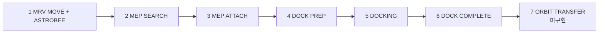
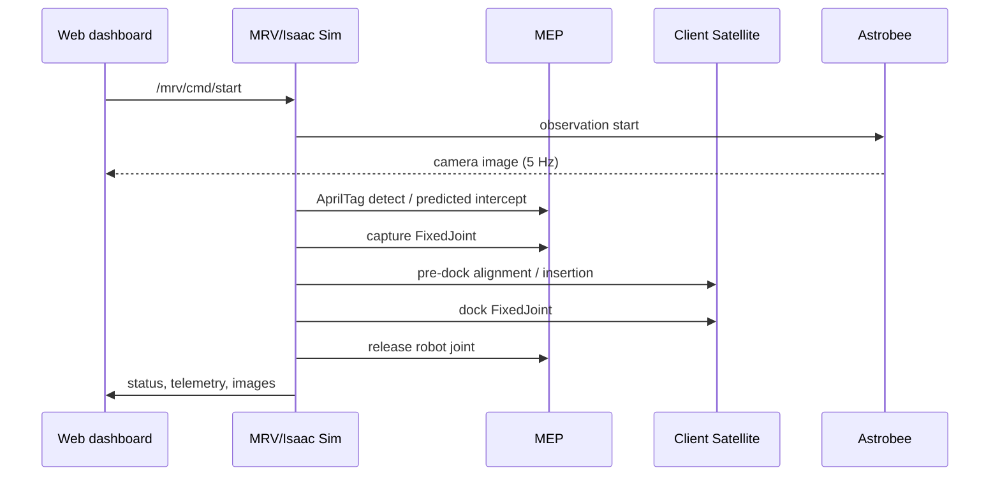

# 04. 전체 시나리오

이 문서는 MRV, MEP, Client Satellite, Astrobee가 한 임무에서 수행하는 동작을 기술한다. 설정값은 `project/config/vision_capture.yaml`, 단계 표시는 `README.md:111-125`를 기준으로 한다. `설계값`은 실행 검증값이 아니다.

## 1. 객체와 핵심 수치

| 객체 | 역할 | 핵심 설정 |
|---|---|---|
| MRV + Canadarm3 | MEP 포획·이송·분리 | 7-DoF; 시작 오프셋 [-5,0,-3] m; 이동 0.4 m/s, 가속 0.15 m/s²; 팔 전개 10 s (`yaml:232-289`) |
| MEP | 수명연장 모듈 | 3,000 kg; 0.01 m/s; six_dof일 때 0.50°/s; AprilTag 4개 60 mm (`yaml:10-26,66-81`) |
| Client Satellite | MEP 도킹 목표 | Ares1 probe를 추력기 노즐 내부 도킹점에 결합; 기본 정지, 이동 시 병진 표류만 검증 범위 (`yaml:307-322`) |
| Astrobee | 관찰 전용 자유비행 카메라 | collider 없음; 4방위 관측·각 5 s; 640×480/5 Hz (`yaml:562-612`) |

## 2. 전체 파이프라인

| UI 단계 | 내부 동작 | 진입 → 종료 조건 | 핵심 기준 |
|---|---|---|---|
| 1 | `MRV_APPROACH_STEP1/2`, `MRV_ARM_DEPLOY`; Astrobee 접근·관측 시작 | 시작 → MRV 목표 20 mm 이내·1 s settle, 팔 오차 0.1° 이내 | 2 leg, 각 상태 timeout 120 s; Astrobee ring margin 25 m |
| 2 | `SEARCH`, predicted-pose approach | tag constellation 발견 → 최종 standoff | vision 10 Hz, 예측 0.3 s, far/near/capture 0.10/0.04/0.01 m/s; approach timeout 60 s |
| 3 | capture `FixedJoint`, `HOLDING` | 거리·각도·속도·횡오차 모두 만족 → 2 s 유지 | ≤150 mm, ≤5°, ≤0.05 m/s, ≤20 mm; holding drift ≤5 mm/0.5° |
| 4 | `DOCK_TARGET_ACQUIRE`, `PRE_DOCK_APPROACH`, alignment | MEP를 1 m pre-dock pose로 이송 → 정렬 통과 | transport/approach 0.15 m/s, align 0.015 m/s·2°/s |
| 5 | `Z_APPROACH`, `FINAL_INSERTION`, `DOCK_READY` | 모든 도킹 조건 → MEP–Client `FixedJoint` | 축/반경 40/40 mm, 축각/roll 2°/4°, 상대속도 ≤0.05 m/s, depth agreement 150 mm |
| 6 | `STABILIZING`, robot release, arm retreat, MRV separation | stack 안정 → MEP release → MRV 이탈 | 2 s 안정화, arm 0.6 m 후퇴, MRV 0.4 m/s×15 s, 최소 거리 증가 0.1 m |
| 7 | — | — | **미구현** |

## 3. 객체별 타임라인

### MRV
1. 팔을 접은 상태에서 X/Y 방향 leg 1, Z 방향 leg 2로 nominal 위치까지 이동한다.
2. 10 s에 걸쳐 Canadarm3를 observation pose로 전개한다.
3. 손목 카메라로 태그를 찾고, 예측한 MEP 결합점을 IK target으로 추종한다.
4. 포획 뒤 Ares1 probe를 Client dock frame에 정렬하고 삽입한다.
5. 결합 안정화 후 robot–MEP joint만 제거, 팔을 0.6 m 후퇴, MRV를 분리한다.

### MEP
- `translation_only`에서는 세계좌표 `[0,-0.8,0.6]` 방향 0.01 m/s로 움직인다.
- `six_dof`에서는 같은 병진과 `[0.005,-0.004,0.006]` rad/s 회전을 합성한다.
- 포획 전에는 camera-estimated pose만 제어에 사용하며 GT는 평가·로그용이다.
- 포획 뒤 MRV EE에, 도킹 뒤 Client에 각각 `FixedJoint`로 결합된다.

### Client Satellite
- 기본 도킹은 정지 satellite이고, `--moving_dock`은 release → velocity match → rendezvous → docking → separation을 실행한다.
- 회전하는 Client는 검증된 구성에 포함하지 않는다 (`yaml:319-322`).
- depth camera는 640×480, 70°이며 노즐 축 거리의 물리 프레임 값과 차이가 150 mm를 넘으면 blind advance하지 않는다 (`yaml:388-408,418-430`).

### Astrobee
- MRV/MEP/도킹 제어에 참여하지 않는다. 관찰 영상만 `/astrobee/camera/image_raw`로 낸다.
- 위성 주변 45°, 135°, 225°, 315° 관측점을 순회하고 각 점에 5 s 체류한다. MRV 분리 단계에는 10 m standoff까지 3 m/s로 접근한다 (`yaml:583-610`).

## 4. 상호작용

## 5. 실행 변형

| 목적 | 명령/설정 | 범위 |
|---|---|---|
| 정지·동적 포획 | `--scenario static|dynamic` | dynamic은 config motion 값 적용 |
| 6-DoF MEP | `--set mep.motion_mode=six_dof` | 병진+회전 |
| 포획만 | `--no_dock` | 1~3단계 |
| 도킹만 | `--dock_only` | MEP를 nominal grasp pose에 붙인 뒤 도킹 |
| 정지 Client | `--no_moving_dock` | Client release 생략 |
| MRV 접근 생략 | `--no_mrv_approach` | observation pose에서 시작 |
| Astrobee 끔 | `--no_astrobee` | 관찰기만 제거 |

## 6. 확인된 결과와 한계

| 항목 | 결과 | 출처 |
|---|---|---|
| 6-DoF 전체 임무 | `full_6dof` #2 SUCCESS, 42/43 checks, sim 203 s | `docs/01_business_requirements.md:31` |
| 포획 | 7/10=70%, 현 six_dof 코드 계열 4/4; capture 24.95–32.22 s | `01_business_requirements.md:32-34` |
| 이동 Client 도킹 | 3/5, 반경오차 39.97–39.98 mm로 40 mm 한계에 근접 | `01_business_requirements.md:35-37` |
| 미구현 | ORBIT TRANSFER(7단계), headless MISSION VIDEO, 회전 Client 도킹 | `README.md:103,123,206-207` |

상세 수용 기준은 [02_system_requirements.md](02_system_requirements.md), 통신 계약은 [03_interface_requirements.md](03_interface_requirements.md)를 따른다.
