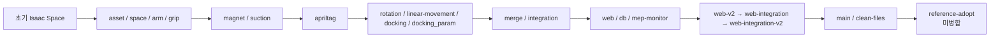

# 05. 브랜치 히스토리

기준은 모든 ref의 git history다. 2026-09-24에 `git rev-list --all --count`로 집계하면 **112 commits**, 기록 기간은 **2026-09-14~2026-09-23**이다. 동일한 원격 브랜치를 로컬 이름과 중복 집계하지 않는다.

## 1. 개발 계보

이 그림은 기능 계보이며 모든 브랜치가 merge commit으로 직접 연결되었다는 뜻은 아니다. 원격에는 실험·자산 브랜치를 포함한 약 20개 `origin/feature/*` ref가 남아 있다.

## 2. 단계별 이력

| 기간 | 주요 브랜치 | 구현/결정 | 근거 |
|---|---|---|---|
| 09-14~17 | 초기 기반, `asset`, `space`, `arm`, `grip` | Isaac Space 환경·자산·Canadarm3 기반 정비 | 전체 history 112 commits |
| 09-18 | `magnet`, `suction` | 물리 부착 실험. Python 기반 suction 성공 기록 | `git log --all`, 2026-09-18 commits |
| 09-19 | `apriltag` | AprilTag 기반 MEP 부착·비전 포획으로 전환 | `feature/apriltag` head: “apriltag 방식 부착” |
| 09-20~21 | `rotation`, `linear-movement`, `docking`, `docking_param` | 6-DoF 유영, Ares1 probe 도킹, 도킹 파라미터 조정 | legacy prompt/report 및 source modules |
| 09-21 | `merge` | 실험 기능 통합 준비 | branch head `gitignore` 정비 |
| 09-22 | `integration` | Astrobee 추가, MRV 접근과 moving Client 계열 통합 | branch head: “astrobee 추가 + 카메라 각도 조정” |
| 09-22 | `web`, `db`, `mep-monitor`, `web-v2`, `web-integration` | Firestore, FastAPI dashboard, 라이브·검증 화면과 영상 재생 | merge history 및 `mep_dashboard/` |
| 09-23 | `web-integration-v2`, `main`, `clean-files` | Firestore cache, 불필요 파일 정리, README/requirements, UI 단위 수정 | `8c98942`, `74cfbd3`, `e1fbab8` |
| 09-23~ | `reference-adopt` | 예측·결합 도킹 controller와 비교 시험 추가 | `10a45ae`; Isaac Sim 검증 대기 |

## 3. 주요 전환

| 이전 | 전환 | 이유 / 결과 |
|---|---|---|
| 정지 물체·절대좌표 IK | AprilTag PnP + 예측 추종 | 움직이는 MEP를 센서값으로 포획; 구체 수치는 [01_business_requirements.md](01_business_requirements.md) |
| 단일 병진 | six_dof MEP | 병진+복합회전 환경을 모델링 |
| 정지 Client 도킹 | 이동 Client rendezvous | 표류 목표에 대한 속도정합·추적 도킹 |
| 콘솔/로그 확인 | ROS→Firestore→dashboard | LIVE 제어와 실행 이력 KPI 제공 |
| legacy sequential docking | `coupled_predictive` 연구 branch | 횡오차가 40 mm 공차 근처인 문제를 개선 대상으로 분리 |

## 4. 현재 기준점

| Ref | 상태 | 의미 |
|---|---|---|
| `main` | 문서·requirements 정리 기준 | 2026-09-23 `74cfbd3` |
| `feature/clean-files` | 현재 작업 기준 | `e1fbab8`: 웹 표시 단위 수정, main 이후 UI 보정 |
| `feature/reference-adopt` | 미병합 | `coupled_dock.py`, offline tests, comparison script 추가. 기본 mode는 legacy이며 Isaac Sim 검증 미완 |

`reference-adopt`의 내용을 merge하기 전에는 legacy와 coupled_predictive를 같은 initial state·seed·scenario에서 비교해야 한다. 측정값은 성공률, 도킹 반경/축 오차, 재정렬 수, 도킹 구간 sim time으로 통일한다.

## 5. 집계 메모

- contributor 표기는 git author identity가 중복되어 있어(예: 대소문자/계정 변형) 사람 수로 정규화하지 않았다.
- 112 commits는 모든 local/remote ref의 도달 가능한 commit 수다. feature branch를 main에 merge한 뒤에는 이 값과 main-only commit 수가 다르다.
- 삭제한 과거 prompt·작업 로그는 Git history에서 복구 가능하다. 이 문서는 과거 작업 지시를 보존하지 않고 프로젝트 기능 계보만 보존한다.
