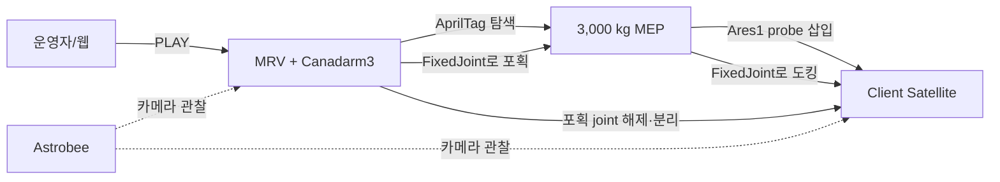
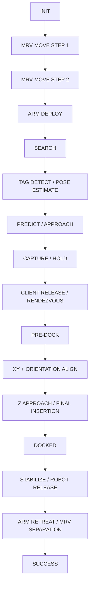
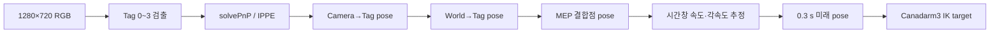
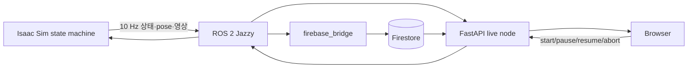

# 전체 파이프라인과 기능 구현 가이드

이 문서는 프로젝트를 처음 보는 사람이 다음 세 가지를 이해하도록 돕습니다.

1. 시뮬레이션을 실행하면 MRV, Canadarm3, MEP, Client Satellite, Astrobee가 어떤 순서로 움직이는가
2. 화면에서 보이는 동작이 코드와 Isaac Sim 물리 안에서 어떻게 구현되어 있는가
3. 어떤 논문의 아이디어를 실제 제어기에 반영했으며, 어떤 내용은 아직 연구 브랜치에만 있는가

설치와 실행 명령은 루트 [README.md](../README.md), 정확한 요구조건과 수치는 [02_system_requirements.md](02_system_requirements.md), 토픽과 API는 [03_interface_requirements.md](03_interface_requirements.md)를 참고합니다.

---

## 1. 한 문장으로 설명하는 프로젝트

**MRV가 표류·회전하는 3,000 kg MEP를 Canadarm3의 손목 카메라로 찾아 붙잡고, MEP 끝의 Ares1 probe를 표류하는 Client Satellite의 추력기 노즐에 삽입한 뒤, MEP를 위성에 남겨 두고 물러나는 임무를 Isaac Sim에서 실행하는 프로젝트입니다.**

Astrobee는 이 작업을 제어하지 않고 주변을 비행하면서 카메라로 관찰합니다. ROS 2와 웹 대시보드는 임무를 시작·중지하고 상태, 영상, 오차, 실행 결과를 기록합니다.



---

## 2. 먼저 알아야 할 객체

| 객체 | 실제 역할 | 구현 방식 | 핵심 코드 |
|---|---|---|---|
| **MRV** | Canadarm3를 싣고 MEP에 접근하는 서비스 우주선 | 선체와 fixed-base 로봇 전체의 root pose를 운동학적으로 이동합니다. 실제 추력·연료 모델은 아닙니다. | `mrv_approach.py` |
| **Canadarm3** | MEP를 탐색·포획하고 probe를 위성 노즐까지 운반 | 7개 관절의 DLS IK 목표를 매 제어 step 갱신합니다. | `vision_capture_demo.py`, `vision.py` |
| **MEP** | Client Satellite에 전달할 임무연장 모듈 | 3,000 kg 무중력 강체이며 병진·회전 속도를 갖습니다. | `vision.py:66-94`, `vision_capture.yaml:mep` |
| **그리퍼/포획부** | MEP 부착면을 붙잡음 | 실제 흡입력이나 전자석 힘을 계산하지 않고, 조건 만족 시 `UsdPhysics.FixedJoint`를 만듭니다. | `capture.py:1-12,330-369` |
| **Ares1 probe** | MEP와 위성 사이의 도킹 핀 | MEP 메시에서 축·끝점·반경을 실행 시 측정합니다. | `docking.py:157-176,371-380` |
| **Client Satellite** | MEP를 인수하는 목표 위성 | GOES-R 추력기 노즐의 축과 내부 도킹점을 실행 시 측정하며, moving 시나리오에서는 동적 강체로 표류합니다. | `docking.py:382-393`, `moving_dock.py` |
| **Astrobee** | 임무 관찰 카메라 | collider와 rigid body가 없는 시각 모델을 정해진 경로로 운동학적으로 이동합니다. 임무 판단에는 관여하지 않습니다. | `astrobee.py:1-38` |

### “그리퍼 흡착”의 정확한 의미

화면에서는 Canadarm3 끝의 반투명 원통이 MEP에 닿아 흡착하는 것처럼 보입니다. 그러나 현재 구현은 진공 흡착이나 자기장 force 모델이 아닙니다.

1. 팔 끝에는 **시각용 capture cylinder**가 있습니다.
2. MEP에는 `gripper_fixture/Cylinder_01`이라는 결합 기준점이 있습니다.
3. 비전 제어기가 위치·자세·상대속도 조건을 만족시킵니다.
4. `CaptureManager`가 두 물체의 **현재 상대 pose를 그대로 보존하는 `FixedJoint`**를 만듭니다.
5. 분리 단계에서는 이 joint prim을 제거하여 MEP를 다시 자유비행 상태로 만듭니다.

따라서 문서와 발표에서는 “흡착”보다 **자석식 포획을 FixedJoint로 근사했다**고 설명하는 편이 정확합니다. Joint는 물체 원점이 아니라 실제 결합점 가까이에 생성되어, 약 8 m 떨어진 MEP 원점에 joint를 둘 때 생기는 긴 lever arm 오차를 피합니다 (`capture.py:330-362`).

---

## 3. 전체 실행은 하나의 상태 머신이다

주 상태 머신은 `vision_capture_demo.py:109-176`의 `State` enum입니다. 매 물리 step 전에 `VisionCaptureDemo.step()`이 현재 상태에 맞는 제어 함수를 한 번 실행합니다.



웹의 7단계는 내부 상태를 이해하기 쉽게 묶은 표현입니다.

| 웹 단계 | 내부 동작 |
|---|---|
| 1. MRV MOVE + ASTROBEE | MRV 2구간 이동, 팔 전개, Astrobee 관찰 시작 |
| 2. MEP SEARCH | AprilTag 검색, pose 추정, 0.3 s 뒤 위치 예측 |
| 3. MEP ATTACH | 속도 구간별 접근, 조건 검사, MEP FixedJoint 생성 |
| 4. DOCK PREP | Client release, 속도 정합, pre-dock 위치 이동, 횡·자세 정렬 |
| 5. DOCKING | 깊이 확인, Z축 접근, 최종 삽입, MEP–Satellite FixedJoint 생성 |
| 6. DOCK COMPLETE | 안정화, Canadarm3–MEP joint 제거, 팔·MRV 후퇴 |
| 7. ORBIT TRANSFER | 표시만 있으며 현재 미구현 |

---

## 4. 단계 1 — MRV 접근과 Canadarm3 전개

### 보이는 동작

MRV가 뒤쪽·아래쪽에서 출발하여 먼저 수평 이동하고, 다음으로 작업 고도까지 올라갑니다. 도착하면 접어 둔 Canadarm3를 펼칩니다. 이동 중 MRV 뒤에는 thruster plume이 표시됩니다.

### 코드가 하는 일

`MrvApproachCfg`의 기본 시작 offset은 `[-5, 0, -3] m`입니다. `step1_axis_mask=[1,1,0]`이므로 첫 구간은 수평 offset을, 두 번째 구간은 남은 수직 offset을 없앱니다 (`mrv_approach.py:51-67`).

이 이동은 물리 추력으로 일어나지 않습니다. MRV 선체와 Canadarm3 base pose를 같은 값만큼 이동시키는 **운동학적 translation**입니다. 속도 0.4 m/s, 가속도 0.15 m/s²의 사다리꼴 속도 프로파일을 사용하며, 목표 20 mm 안에 들어오고 1 s가 지나면 다음 구간으로 넘어갑니다.

팔은 7개 joint의 접힌 pose에서 관측 pose까지 10 s 동안 보간합니다. MRV가 이동하는 동안 MEP는 계속 자유비행하므로, 코드는 MEP 초기 pose를 MRV 접근 예정 시간만큼 뒤로 역전파하여 팔 전개가 끝났을 때 기존 포획 시나리오와 같은 상대 배치가 되도록 합니다 (`mrv_approach.py:93-99,166-190`).

Thruster plume은 별도 prim에 만든 VFX입니다. collider가 없고 force를 가하지 않으며, 생성 실패도 임무를 중단시키지 않습니다 (`mrv_approach.py:17-19`).

---

## 5. 단계 2 — AprilTag로 MEP 찾기

### 왜 AprilTag를 쓰는가

MEP의 정답 좌표를 제어기에 직접 넘기면 움직이는 물체를 센서로 찾는 시스템이라고 할 수 없습니다. 이 프로젝트는 Canadarm3 손목 카메라 영상에 보이는 4개의 AprilTag만으로 결합점 pose를 구합니다.

### 처리 순서



- 태그 family: `tag36h11`
- 태그 수와 ID: 4개, `0~3`
- 검은 사각형 한 변: 60 mm
- 손목 카메라: 1280×720, 수평 FOV 90°
- 비전 처리율: 10 Hz
- 예측 horizon: 0.3 s

이미지에서 구한 `Camera → Tag` pose에 손목 링크와 카메라의 고정 transform을 곱해 `World → Tag` pose를 얻습니다. 마지막으로 설계 시 알고 있는 `Tag → Cylinder_01` transform을 곱해 실제 포획 목표를 계산합니다 (`vision.py:1-23`).

`translation_only`는 최근 위치에서 선속도를 구하고, `six_dof`는 위치와 회전을 함께 fitting하는 constant-twist predictor를 사용합니다. 1 s 이상 tag를 잃거나 추정 속도가 현실성 한계를 넘으면 팔을 계속 전진시키지 않고 실패 상태로 전환합니다.

### GT의 용도

시뮬레이터가 알고 있는 MEP ground truth pose는 오차 계산과 결과 판정에 사용합니다. 정상 제어 목표에는 넣지 않습니다. 이것이 “비전 기반 제어”와 “좌표를 알고 움직이는 데모”의 차이입니다.

---

## 6. 단계 3 — Canadarm3 접근과 MEP 포획

비전이 계산한 미래 결합점 앞에 standoff pose를 만들고 Canadarm3의 DLS IK로 추종합니다. 멀리 있을 때와 가까이 있을 때 속도를 바꿉니다.

| 구간 | 기본 속도 |
|---|---:|
| 먼 접근 | 0.10 m/s |
| 근접 접근 | 0.04 m/s |
| capture range | 0.01 m/s |

최종 결합은 단순 거리 하나로 결정하지 않습니다. 비전 파이프라인의 포획 조건은 다음을 동시에 확인합니다.

| 조건 | 기준 |
|---|---:|
| EE–MEP 결합점 거리 | ≤150 mm |
| 면 방향 오차 | ≤5° |
| 상대 선속도 | ≤0.05 m/s |
| 결합축 횡오차 | ≤20 mm |
| six_dof 상대 각속도 | ≤0.01 rad/s |

조건이 맞으면 외부 controller가 `CaptureManager.attach()`를 호출하고 Canadarm3 마지막 link와 MEP 사이에 `capture_joint`를 만듭니다. Joint frame은 생성 순간의 live physics pose에서 계산하므로, 결합 순간에 MEP가 다른 위치로 튀지 않습니다 (`capture.py:330-369`).

포획 뒤에는 정해진 시간 동안 MEP–EE 상대 pose drift가 5 mm와 0.5° 안에 머무는지도 검사합니다.

> `capture.py`에는 수동 환경용 거리 기반 auto-attach(기본 0.6 m)도 남아 있습니다. 전체 비전 파이프라인은 더 엄격한 150 mm·각도·속도·횡오차 조건을 검사한 뒤 명시적으로 `attach()`하므로 두 기준을 혼동하면 안 됩니다.

---

## 7. 단계 4 — 표류하는 Client Satellite와 랑데부

moving-client 시나리오에서 Client Satellite는 dynamic rigid body이며 중력은 0입니다. 기본 명령 속도는 world +X 방향 0.02 m/s입니다 (`moving_dock.py:47-73`). 속도를 순간적으로 써 넣지 않고 `F=ma`, `τ=Iα` 형태의 제한된 force/torque ramp로 release합니다.

MRV는 자유비행 강체가 아니라 운동학적으로 움직이는 base이므로, Client와 같은 world velocity를 갖도록 추종합니다. 판단은 절대좌표가 아니라 다음 상대값으로 합니다.

$$v_{rel,MRV}=v_{MRV}-v_{Client}$$
$$v_{rel,MEP}=v_{MEP}-v_{Client}$$
$$e_{MRV}=(p_{Client}-p_{MRV})-d_{ref}$$

`d_ref`는 정지 Client에서 검증했던 상대 배치입니다. 상대 위치와 상대속도를 이 값으로 되돌리면, 전체 장면이 world에서 움직이더라도 도킹 controller 입장에서는 정지 시나리오와 같은 기하가 됩니다 (`moving_dock.py:15-23`).

기본 moving 시나리오는 release와 랑데부 제어를 도킹 이송과 동시에 수행합니다. 포획한 3 t MEP가 급격히 끌려가지 않도록 MRV 가속도는 0.004 m/s², 위치 보정 속도는 최대 0.02 m/s로 제한합니다.

---

## 8. 단계 4~5 — MEP probe를 위성 노즐에 정렬

### 하드코딩하지 않는 기하

MEP와 위성 USD 모델의 scale이나 mesh가 바뀌면 고정 좌표는 틀어집니다. `DockingGeometry`는 실행 시작 시 메시에서 다음을 측정합니다.

- Canadarm3 capture cylinder의 접촉면
- MEP 본체의 평평한 grasp face
- Ares1 probe의 중심축, 끝점, 반경
- 위성 thruster 노즐의 중심축, 출구, 내경 profile

이 값으로 `MEP_GRASP_POINT`, `PROBE_DOCK_POINT`, `SAT_DOCK_POINT` frame을 만듭니다 (`docking.py:356-420`). 이후 모든 도킹 오차는 world XYZ가 아니라 **Satellite dock frame**에서 계산합니다.

$$T_D^P=(T_W^D)^{-1}T_W^P$$

- Z: probe가 앞으로 얼마나 더 들어가야 하는가
- X/Y: 노즐 중심축에서 얼마나 벗어났는가
- 회전: probe 축과 노즐 축, roll이 얼마나 다른가

### legacy 제어 순서

1. **PRE_DOCK_APPROACH**: probe tip을 노즐 앞 1 m 지점으로 운반
2. **XY_ALIGN**: 횡오차 보정
3. **ORIENTATION_ALIGN**: 축 방향과 roll 정렬
4. **ALIGNMENT_CHECK**: 정렬이 일정 시간 유지되고 probe가 정착했는지 확인
5. **Z_APPROACH**: 노즐 축을 따라 접근
6. **FINAL_INSERTION**: 느린 속도로 끝까지 삽입
7. **DOCK_READY**: 모든 결합 조건을 동시에 확인

Canadarm3+3 t MEP에는 약 20 s 주기의 저감쇠 흔들림이 관측되었습니다. 그래서 속도를 계단처럼 바꾸지 않습니다. `ramped()`는 가속을 제한하고, `decelerated()`는 남은 거리에 비례해 연속 감속합니다 (`probe_dock.py:314-357`). 횡 정렬도 0.015 m/s로 느리게 수행합니다.

---

## 9. probe RGB-D 카메라와 안전 게이트

probe에 부착한 640×480 RGB-D 카메라는 노즐 접근 화면과 축방향 거리를 제공합니다. 중앙 9×9 pixel patch의 유효 depth median을 사용하며, NaN·inf·범위 밖 값은 버립니다 (`probe_dock.py:365-387`).

카메라 depth만 믿지 않습니다. frame 기하로 계산한 남은 거리와 비교하여 차이가 150 mm를 넘으면 probe를 전진시키지 않습니다. 또한 probe가 노즐 내부에 있을 때 표면과 내벽 사이 clearance가 20 mm보다 작아지면 중단합니다.

최종 `FixedJoint`는 아래 조건이 모두 맞을 때만 만들어집니다.

| 조건 | 현재 운용값 |
|---|---:|
| 축방향 오차 | ≤40 mm |
| 반경방향 오차 | ≤40 mm |
| probe–nozzle 축각 | ≤2° |
| roll 오차 | ≤4° |
| 상대속도 | ≤0.05 m/s |
| 노즐 내벽 여유 | ≥20 mm |
| depth | 기하 거리와 ≤150 mm 차이 |

조건을 만족하면 `DockingManager`가 MEP body와 satellite body 사이에 `docking_joint`를 probe tip 위치에 생성합니다. Canadarm3 포획 joint와 마찬가지로 현재 상대 pose를 고정하므로 snap을 피합니다 (`docking.py:428-473`).

---

## 10. 단계 6 — MEP를 위성에 남기고 MRV 분리

도킹이 끝나면 joint는 두 개입니다.

```text
Canadarm3 -- capture_joint -- MEP -- docking_joint -- Client Satellite
```

분리할 때는 `capture_joint`만 제거합니다. `docking_joint`는 유지되므로 MEP가 Client Satellite에 남습니다.

설정에 따라 도킹 stack을 2 s 안정화하고 속도를 줄인 뒤 release하거나, 즉시 release하면서 background에서 정지시킵니다. 이후 팔은 MEP 면에서 0.6 m 후퇴하고, MRV는 0.4 m/s로 최대 15 s 이동합니다. 분리 성공은 단순 시간 경과가 아니라 MEP와의 거리 증가가 0.1 m 이상이며 접촉력이 50 N 이하인지로 검사합니다.

---

## 11. Astrobee는 무엇을 하고 무엇을 하지 않는가

Astrobee는 위성 주변 관측점 4개(45°, 135°, 225°, 315°)를 순회하며 각 지점에 5 s 머뭅니다. 카메라는 640×480 영상을 5 Hz로 `/astrobee/camera/image_raw`에 발행합니다.

도킹 완료 상태를 받으면 관측 loop를 끝내고, 분리되는 MRV를 10 m 거리까지 따라갑니다 (`astrobee.py:50-77,495-540`).

Astrobee가 **하지 않는 일**:

- AprilTag 검출
- MEP pose 또는 Client 각속도 추정
- 도킹 가능 여부 판단
- Canadarm3나 docking controller에 명령
- 물리 충돌 또는 추진력 생성

즉, Astrobee는 **관찰·시각화 subsystem**이며 제어 loop와 분리되어 있습니다.

---

## 12. ROS 2, Firestore, 웹은 파이프라인을 어떻게 감싼다



- `/mrv/state`: 현재 내부 상태
- `/mrv/status`: 오차·속도·tag·capture 정보 JSON
- `/mrv/cam_wrist/image_raw`: 포획 카메라
- `/mrv/dock/*`: probe와 dock pose
- `/astrobee/camera/image_raw`: 관찰 카메라
- `/mrv/cmd/start|pause|resume|abort`: 운영 명령

Firestore는 실행 요약과 기본 5 Hz telemetry를 저장합니다. 웹 LIVE 탭은 ROS 실시간 값을, VALIDATION 탭은 저장된 실행의 성공률·정밀도·임무 시간·영상 구간을 보여줍니다. 자세한 계약은 [03_interface_requirements.md](03_interface_requirements.md)에 있습니다.

---

## 13. 논문에서 가져온 아이디어

논문은 모두 같은 수준으로 코드에 반영된 것이 아닙니다. 아래처럼 **현재 legacy에 반영**, **reference-adopt 브랜치에 구현**, **검토만 하고 미채택**을 구분해야 합니다.

### 13.1 현재 legacy에 반영된 제어 원리

#### Singer & Seering (1990) — Input Shaping

핵심 아이디어는 불연속 가속·감속 명령이 구조의 고유진동 모드를 가진하므로, 명령을 성형해 잔류 진동을 줄이는 것입니다.

현재 코드는 논문의 ZV/ZVD impulse shaper 자체를 구현하지는 않았습니다. 대신 같은 문제를 피하기 위해 다음을 적용했습니다.

- probe 속도 상승을 `accel_mps2`로 제한
- 목표 근처에서 남은 거리에 비례해 연속 감속
- 정렬 속도를 이송 속도의 약 1/10 수준으로 제한

즉, **논문이 설명한 문제를 근거로 저역통과형 명령 성형을 구현한 상태**입니다. 0→0.15 m/s를 0.01 m/s²로 올리면 15 s가 필요합니다.

#### Chen & Sun (2020) — constrained underactuated control

핵심은 구동부 이동과 비구동 swing을 연속적으로 결합하고, swing이 안전 한계에 가까워질수록 전진을 줄이는 것입니다.

legacy는 연속 감속과 corridor rollback으로 일부 개념만 반영합니다. 완전한 barrier Lyapunov controller는 아닙니다. 이 아이디어는 `reference-adopt`의 smooth soft gate 설계에 더 직접적으로 반영되었습니다.

#### Aghili (2009) — heavy-payload impedance control

무거운 payload와 탄성 있는 manipulator에서 안정한 impedance/damping gain을 정하는 문제를 다룹니다. 현재 코드에는 `swing_damping` 항이 있지만 1.0 gain 시험에서 0.1 s 안에 불안정해져 기본값 0으로 꺼져 있습니다.

따라서 이 논문은 **성공적으로 적용된 기능**이라기보다, 현재 damping 항이 왜 비활성이고 앞으로 어떤 방식으로 안정 gain을 구해야 하는지 설명하는 근거입니다.

### 13.2 `feature/reference-adopt`에 구현한 개선

이 브랜치는 현재 작업 브랜치에 아직 merge되지 않았으며 Isaac Sim end-to-end 검증도 완료되지 않았습니다.

#### Zhou, Liu, Cai — *Motion-planning and pose-tracking based rendezvous and docking with a tumbling target*

가져온 아이디어:

- 현재 target pose를 뒤쫓는 대신 target motion으로 미래 desired docking pose를 생성
- desired pose 생성과 pose tracker를 분리

구현:

- `predict_body_frame`: Client CoM 기준 constant-twist로 0.3 s 뒤 dock frame 예측
- `CoupledPoseTracker`: 예측 pose 추종

논문의 전체 trajectory optimization은 가져오지 않았습니다.

#### Ye, Lu, Mu — *Compound control for autonomous docking to a three-axis tumbling target*

가져온 아이디어:

- target 상대좌표에서 위치와 자세를 동시에 추종
- 위치·자세·상대 선속도·상대 각속도를 함께 0으로 수렴

구현:

- SO(3) 회전벡터 $e_R=\log(R_dR_c^T)$
- feed-forward + P + D 명령
- 위치/자세 결합 정렬
- binary gate 대신 smooth soft gate
- 0.5 s 연속 조건을 요구하는 alignment gate
- 진입 50 mm / rollback 80 mm의 hysteresis

논문의 sliding-mode controller는 사용하지 않았습니다. 현재 plant는 thruster로 직접 움직이는 강체가 아니라 joint-drive+3 t payload의 약 20 s 저감쇠 모드를 통과하므로, switching 제어가 모드를 다시 가진할 위험이 있기 때문입니다.

### 13.3 검토했지만 현재 채택하지 않은 연구

| 연구 | 미채택 이유 |
|---|---|
| Nenchev et al. (1999), Reaction Null-Space | 현재 MRV base는 free-floating 동역학이 아니라 world-fixed articulation의 운동학적 이동입니다. 주요 문제도 base reaction보다 payload swing입니다. |
| Singhose (2009), multi-mode shaper | 현재 관측한 주요 모드는 약 20 s 단일 모드입니다. 다중 모드 cascade는 아직 필요성이 입증되지 않았습니다. |
| Zhang et al. (2022), macro/micro + backlash | 현재 Implicit PD 모델에는 실제 gear backlash가 없습니다. |
| Flatness-based trajectory planning | 표류 target pose를 매 step 다시 읽는 폐루프 구조이므로 고정된 offline trajectory만으로는 부족합니다. |

논문별 코드 대응과 정량 비교는 [06_references_and_improvements.md](06_references_and_improvements.md)에 정리되어 있습니다.

---

## 14. 처음 코드를 읽는 순서

1. `project/scripts/vision_capture.py` — 실행 옵션과 진입점
2. `project/config/vision_capture.yaml` — 모든 운용 수치
3. `vision_capture_demo.py:State`와 `step()` — 전체 상태 머신
4. `mrv_approach.py` — MRV 2구간 이동과 팔 전개
5. `vision.py` — AprilTag pose·운동 예측
6. `capture.py` — Canadarm3–MEP FixedJoint
7. `docking.py` — USD 메시에서 docking frame 추출, MEP–Satellite FixedJoint
8. `probe_dock.py` — 정렬·depth·결합 조건
9. `moving_dock.py` — Client release, 상대속도 정합, 분리
10. `astrobee.py` — 관찰 경로와 ROS 영상
11. `ros_interface.py` → `firebase_bridge.py` → `mep_dashboard/` — 운영·기록·시각화

## 15. 현재 한계

- 7단계 `ORBIT TRANSFER`는 미구현입니다.
- MRV 이동과 Astrobee 비행은 실제 thruster dynamics가 아니라 운동학적 이동입니다.
- Astrobee는 인지·판단 기능이 없는 관찰 모델입니다.
- 회전하는 Client Satellite 도킹은 검증된 구성에 포함하지 않습니다.
- gripper 포획과 MEP 도킹은 접촉 mechanics·latch 구조를 상세 모델링하지 않고 `FixedJoint`로 근사합니다.
- headless 실행에서는 GUI viewport 기반 임무 영상이 생성되지 않습니다.
- `reference-adopt`의 coupled predictive controller는 offline 검증 단계이며, legacy 대비 Isaac Sim 성공률·오차 개선을 아직 주장할 수 없습니다.
